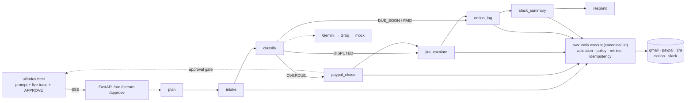

# LedgerPilot — AI Revenue Operations Agent

**Swytchcode × LangGraph · Track 6 · Build with Swytchcode Gurgaon Edition (Sep 26, 2026)**

LedgerPilot does *billing day* for you: give it one sentence —
*"It's billing day. Find unpaid invoices, chase overdue ones with PayPal, escalate disputes
to Jira, log everything to Notion, and summarize in Slack"* — and it plans, reasons, and
executes across **five Swytchcode toolkits**, showing every call as a live audit trace:

```
[ 1] PLAN            interpreted mode=write, announced 6 steps
[ 2] INTAKE          found 4 invoices (gmail)              → classify
[ 3] CLASSIFY        1×OVERDUE, 1×DISPUTED, 1×DUE_SOON, 1×PAID
[ 4] PAYPAL_CHASE    pending approval  ── operator clicks Approve ──▶ INV-2430
[ 5] JIRA_ESCALATE   dispute #1043 → OPS-6393              (PayPal skipped by design)
[ 6] NOTION_LOG      4 rows, Status from actual responses
[ 7] SLACK_SUMMARY   posted to #finance-ops
[ 8] RESPOND         final answer with every ID
```

*(screenshots: see [`docs/SUBMISSION_CHECKLIST.md`](docs/SUBMISSION_CHECKLIST.md) §4 — captured
during the live demo and attached to the Commudle submission)*

## What makes it an *agent* (not a script)

| | |
|---|---|
| **Plans before acting** | LLM decides `write` vs `read_only` mode and announces an ordered plan |
| **Conditional branches** | DISPUTED → Jira only · OVERDUE → PayPal · DUE_SOON/PAID → log only |
| **Human-in-the-loop** | Money-moving PayPal calls block on a real approval gate (`.swytchcode/policies.json`) |
| **Honest degradation** | Gmail/LLM/Slack failures become visible trace cards, never silent lies |

## Architecture



Full details: [`docs/TECHNICAL_ARCHITECTURE.md`](docs/TECHNICAL_ARCHITECTURE.md) ·
Product: [`docs/PRD.md`](docs/PRD.md) · Security: [`docs/SECURITY.md`](docs/SECURITY.md)

## Evidence: 5 Swytchcode toolkits wired

From committed [`.swytchcode/tooling.json`](.swytchcode/tooling.json) — every external call
goes through `swx.tools.execute(<canonical_id>)`, no raw HTTP anywhere:

| Toolkit | Canonical IDs | Role in the chain |
|---|---|---|
| `gmail` | `gmail.messages.list`, `gmail.messages.get` | invoice intake → classify |
| `paypal` | `paypal.invoices.send` | overdue chase **(approval-gated, sandbox)** → notion → slack |
| `jira` | `jira.issues.create` | dispute escalation → notion → slack |
| `notion` | `notion.databases.query`, `notion.pages.create` | ops log, status from live responses |
| `slack` | `slack.chat.postMessage` | summary built from real results |

Policy evidence: [`.swytchcode/policies.json`](.swytchcode/policies.json) — `paypal.*` writes
require human approval; Gmail is read-only; live-money PayPal is denied.

## Setup

```bash
git clone https://github.com/dwivedi-mohit/swytchcode-hackathon-build-by-mohit.git
cd swytchcode-hackathon-build-by-mohit

python3 -m venv .venv && source .venv/bin/activate
pip install -r requirements.txt

cp .env.example .env        # add GEMINI_API_KEY / GROQ_API_KEY  (or set MOCK_LLM=1)
./scripts/setup.sh          # swy init + 5 toolkits + tools + doctor   (needs Swytchcode CLI)
python scripts/smoke_test.py   # PASS/FAIL matrix, floor = 3 toolkits

python -m server.main       # → http://localhost:8000
```

**No keys?** `MOCK_LLM=1 MOCK_SWX=1 python -m server.main` runs the complete demo offline —
deterministic LLM + fake tool responses (same graph, same trace).

## The 3 demo prompts

1. `It's billing day. Find unpaid invoices, chase overdue ones with PayPal, escalate disputes to Jira, log everything to Notion, and summarize in Slack.`
2. `Chase only invoices over ₹50,000 with PayPal and log the rest to Notion.`
3. `What did we chase this week?` — read-only mode, **zero** write calls

## Tests

```bash
python -m pytest tests/ -q     # 16 tests: graph E2E + API/SSE, all mock, no keys, <2s
```

Covers: full-run trace ≥6 events · disputed invoice never reaches PayPal · approval gate
blocks then approves · timeout → SKIPPED · re-run doesn't double-chase · read-only writes
nothing · SSE replay has no duplicate cards.

## Troubleshooting

| Symptom | Fix |
|---|---|
| Intake pill says **DEMO DATA** | Gmail not connected — expected fallback (SECURITY E3); run `swy auth gmail` |
| Amber toast about LLM | Gemini failed → auto-failed over to Groq → both off → deterministic fallback; add a key |
| "Connection lost" banner | Venue wifi dropped — hit Retry (SSE replays history, no duplicate cards) or switch to hotspot; [backup video](docs/demo/run.mp4) |
| PayPal call says *timed out* | Approval not clicked within 120 s → invoice logged as SKIPPED (E7), rest of run continues |
| Want a clean slate | Restart `python -m server.main` (state is in-process by design) |

## Repository

```
agent/     state · llm switch · swx wrapper · 7 graph nodes · approval gate
server/    FastAPI + SSE          ui/     single-file trace UI (no build step)
seed/      demo invoices          scripts/ setup.sh · smoke_test.py
tests/     mock E2E (graph + API) docs/    8 project docs + demo assets
.swytchcode/  tooling.json + policies.json (committed evidence)
```

## Scope & attribution

Solo entry for **Build with Swytchcode** (Gurgaon, Sep 26 2026), Track 6. Built with
[LangGraph](https://github.com/langchain-ai/langgraph) + Swytchcode Runtime SDK.
Demo/test data only — PayPal pinned to sandbox; no production credentials in this repo.

[MIT License](LICENSE)
