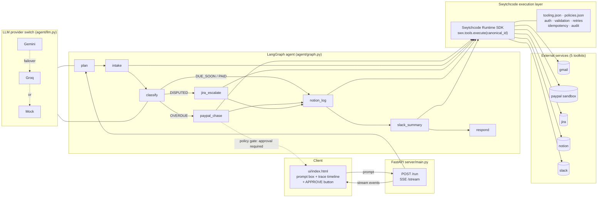

# Technical Architecture Document

**Product:** LedgerPilot — AI Revenue Operations Agent
**Version:** v1.0 · **Date:** 25 September 2026
**Audience:** the build (AI coding tools + human), mentors, and the submission repo

---

## 1. Tech Stack (with reasoning)

| Layer | Choice | Version / notes | Why this |
|---|---|---|---|
| Language | **Python** | 3.11+ | Fastest iteration for a solo 4.5-hour build; Swytchcode's LangGraph quickstart is Python-first |
| Agent framework | **LangGraph** | 0.2+ (`langgraph`) | Required "agentic framework" per rules; a *graph* is visible proof of agency; official Swytchcode quickstart + `langswytch` reference repo exist |
| Integration runtime | **Swytchcode Runtime SDK** | `swytchcode_runtime` (+ CLI `swytchcode`/`swy`) | Mandated: ≥3 Swytchcode APIs. Provides auth, validation, retries, idempotency, policy, audit for every call |
| LLM (primary) | **Google Gemini** | `langchain-google-genai`, key `GEMINI_API_KEY` | Free tier sufficient for demo |
| LLM (fallback) | **Groq** | `langchain-groq`, key `GROQ_API_KEY` | Second provider = resilience against quota/region failures |
| LLM (test) | **Mock LLM** | `MOCK_LLM=1` | Deterministic E2E tests without keys |
| Backend | **FastAPI** + Uvicorn | 0.110+ | Minimal SSE streaming, single process, easy to run |
| Streaming | **Server-Sent Events** | plain HTTP | One-directional trace stream; simpler than WebSockets |
| Frontend | **Single-file HTML/CSS/JS** | no build step, no framework | UX weight is 5% of rubric — zero tooling risk |
| State store | **LangGraph `MemorySaver`** | in-process | Demo-scale only; no DB |
| System of record | **Notion Ops DB** | via Swytchcode `notion` | No database to provision; doubles as integration #4 |
| Secrets | **`.env`** + `python-dotenv` | never committed | See §6 |
| Repo | **Public GitHub** | submission requirement | — |

**Deliberately absent:** Postgres/SQLite, Docker, React/Next, Redis, queues, auth server.
Reason: every one of these adds failure surface inside a 4.5-hour window and scores zero rubric
points (UX 5%, none for infra).

---

## 2. High-Level Architecture



**Data flow of one tool call (every node follows this):**

```
LangGraph node
  → build args dict
  → swx.tools.execute("invoices.invoicing.send.create", {"params": {...}, "Authorization": ...})
  → Swytchcode: schema validation → policy check (policies.json) → auth → HTTP
      → retries + idempotency key on failure
  → structured JSON response
  → node writes {reasoning, toolkit, canonical_id, request, response, decision}
    into state.trace[]
  → FastAPI emits SSE event → UI renders trace card
```

---

## 3. File & Folder Structure

```
ledgerpilot/
├── README.md                        # submission doc: overview, setup, flow, evidence
├── docs/
│   ├── PRD.md                       # product requirements (this set, doc 1)
│   ├── TECHNICAL_ARCHITECTURE.md    # this file (doc 2) — also the submission diagram
│   ├── SECURITY.md                  # auth, permissions, errors, edge cases (doc 3)
│   ├── FRONTEND_SPEC.md             # design system + integration spec (doc 4)
│   ├── TICKETS.md                   # build tickets (doc 5)
│   ├── SUBMISSION_CHECKLIST.md      # Commudle checklist (doc 6)
│   └── DEMO_SCRIPT.md               # pitch + prompts + Q&A (doc 7)
├── .env.example                     # all keys, documented, no values
├── .gitignore                       # .env, __pycache__, .swytchcode/auth*, videos
├── .swytchcode/
│   ├── tooling.json                 # EVIDENCE: 5 enabled toolkits + canonical IDs
│   ├── policies.json                # approval gate on invoices.* writes
│   └── (generated bundles/auth — gitignored where sensitive)
├── agent/
│   ├── __init__.py
│   ├── state.py                     # InvoiceState TypedDict + trace event schema
│   ├── llm.py                       # provider switch: gemini | groq | mock
│   ├── graph.py                     # build_graph(): nodes, conditional edges, checkpointer
│   ├── swx.py                       # Swytchcode singleton: tools.get / tools.execute wrappers
│   └── nodes/
│       ├── __init__.py
│       ├── plan.py                  # interpret request → plan + mode (write|read-only)
│       ├── intake.py                # gmail search | seed/invoices.json fallback
│       ├── classify.py              # LLM labels + per-invoice decisions
│       ├── paypal_chase.py          # gated paypal.* exec
│       ├── jira_escalate.py         # jira issue create (skips PayPal by design)
│       ├── notion_log.py            # notion page/db-row create
│       ├── slack_summary.py         # slack.chat.post, text from results
│       └── respond.py               # final answer assembly
├── server/
│   ├── __init__.py
│   ├── main.py                      # FastAPI app, /run, /healthz, static mount
│   └── stream.py                    # graph.stream → SSE event translation
├── ui/
│   └── index.html                   # single-page prompt + trace UI (spec: FRONTEND_SPEC.md)
├── seed/
│   └── invoices.json                # 4 invoices: overdue / disputed / due-soon / paid
├── scripts/
│   ├── setup.sh                     # swy init → get 5 toolkits → add tools → doctor
│   └── smoke_test.py                # one exec per toolkit; prints PASS/FAIL matrix
├── tests/
│   └── test_graph.py                # MOCK_LLM E2E: prompt → final answer, asserts trace
└── docs/demo/                       # backup demo video (gitignored, submitted separately)
```

**Organization rules**

- `agent/` knows nothing about HTTP; `server/` knows nothing about tools; `ui/` knows nothing
  about Python internals — it consumes SSE only.
- Every external effect (API call) happens in `agent/swx.py` — one choke point for logging,
  retries, and mock mode.
- One file per node: a node never grows past ~100 lines; otherwise it belongs in a helper.

---

## 4. Data Structures (the "schema" of this app)

There is **no SQL database**. State lives in three places: the LangGraph state, the Notion Ops
DB, and the trace log. All three are specified below in plain English.

### 4.1 LangGraph state — `InvoiceState` (agent/state.py)

Think of it as one Excel sheet that every node reads and appends to:

| Field | Type | Meaning |
|---|---|---|
| `prompt` | str | The raw sentence the operator typed |
| `run_id` | str | Unique id per run — idempotency + Notion dedupe + SSE stream key |
| `mode` | `"write" \| "read_only"` | Set by `plan`; read-only skips all write nodes |
| `plan` | list[str] | Ordered steps the agent announced |
| `invoices` | list[Invoice] | Parsed invoices (see 4.2) |
| `decisions` | list[Decision] | One entry per invoice: label + chosen action + reason |
| `trace` | list[TraceEvent] | Append-only; streamed to the UI (see 4.3) |
| `results` | dict | `{invoice_key: {paypal_id, jira_key, notion_page, ...}}` |
| `approval_pending` | TraceEvent \| null | The PayPal call awaiting one-click approval |
| `final_answer` | str | Rendered summary for the user |
| `errors` | list[str] | Non-fatal errors surfaced in the final answer |

**Invoice (parsed object):** `id`, `vendor`, `amount`, `currency`, `due_date`, `email_ref`,
`raw_excerpt`.

**Decision object:** `invoice_id`, `label` (`OVERDUE|DISPUTED|DUE_SOON|PAID`), `action`
(`paypal_chase|jira_escalate|log_only|skip`), `reason` (one line, LLM-written).

### 4.2 Notion Ops DB schema ("Excel sheet in Notion")

Database: **LedgerPilot Ops Log**

| Column | Type | Written by | Source of truth |
|---|---|---|---|
| Invoice ID | Title | notion_log | parsed from email/seed |
| Vendor | Text | notion_log | parsed |
| Amount | Number | notion_log | parsed |
| Due Date | Date | notion_log | parsed |
| Label | Select (OVERDUE/DISPUTED/DUE_SOON/PAID) | notion_log | classify |
| Status | Select (CHASED/DISPUTED/LOGGED/PAID/SKIPPED) | notion_log | **PayPal/Jira response values** |
| PayPal Invoice ID | Text | notion_log | PayPal response (empty if skipped) |
| Jira Key | Text | notion_log | Jira response (empty if skipped) |
| Run ID | Text | notion_log | one per prompt execution |
| Ran At | Date | notion_log | timestamp |

Rule: `Status`, `PayPal Invoice ID`, `Jira Key` are **never** derived from the plan — they copy
what the external API actually returned. This is the "output drives next action" evidence.

### 4.3 TraceEvent (SSE payload → UI card)

```json
{
  "step": 4,
  "node": "paypal_chase",
  "reasoning": "Invoice #1042 is 12 days overdue → chase via PayPal",
  "toolkit": "paypal",
  "canonical_id": "invoices.invoicing.send.create",
  "request": {"params": {"invoice_id": "1042", "amount": "5400"}},
  "response": {"id": "INV-8F2K", "status": "SENT"},
  "decision": "Log status=CHASED, include id INV-8F2K in Slack summary",
  "status": "ok | pending_approval | approved | failed | skipped",
  "ts": "2026-09-26T11:42:03Z"
}
```

### 4.4 `seed/invoices.json`

```json
{
  "invoices": [
    {"id": "1042", "vendor": "Acme Supplies",   "amount": 5400, "currency": "INR",
     "due_date": "2026-09-14", "status_hint": "12 days overdue", "email_ref": "seed"},
    {"id": "1043", "vendor": "Northwind LLP",   "amount": 18200, "currency": "INR",
     "due_date": "2026-09-20", "status_hint": "dispute: wrong amount quoted", "email_ref": "seed"},
    {"id": "1044", "vendor": "Bluebird Studio", "amount": 900,  "currency": "INR",
     "due_date": "2026-10-02", "status_hint": "due next week", "email_ref": "seed"},
    {"id": "1045", "vendor": "Cobalt Media",    "amount": 3100, "currency": "INR",
     "due_date": "2026-09-10", "status_hint": "paid Sep 12", "email_ref": "seed"}
  ]
}
```

---

## 5. Configuration & Environment

### 5.1 `.env.example`

```bash
# --- LLM (one of GEMINI/GROQ required unless MOCK_LLM=1) ---
GEMINI_API_KEY=
GROQ_API_KEY=
LLM_PROVIDER=gemini            # gemini | groq | mock
MOCK_LLM=0                     # 1 = deterministic, no network

# --- Swytchcode (usually provided by `swy login`, not here) ---
SWYTCHCODE_TOKEN=              # only if CLI needs env-based auth

# --- Gmail (only if live intake enabled) ---
GMAIL_ENABLED=1                # 0 = seed fallback
GMAIL_QUERY=from:(billing OR invoice) is:unread

# --- PayPal sandbox (NEVER live credentials) ---
PAYPAL_ENV=sandbox

# --- App ---
PORT=8000
MAX_INVOICES=10                # safety cap per run
```

### 5.2 Configuration rules

1. **No secret is ever hardcoded or committed.** `.gitignore` contains `.env`.
2. Swytchcode stores integration credentials itself after `swy auth` / `swy login` — the app
   passes `Authorization` only where the tool schema demands it.
3. PayPal is **hard-pinned to sandbox**; the code path to live is not implemented at all.
4. Canonical IDs are the only way tools are referenced — no raw HTTP, no hand-built URLs.
5. `tooling.json` is committed (it holds enabled tool names/versions, not secrets) as rubric
   evidence; any file under `.swytchcode/` that stores tokens is gitignored.
6. Everything the judge needs is reproducible from `README.md` + `.env.example` alone.

---

## 6. Agent Graph Specification (build contract)

| Node | Reads | Calls (Swytchcode) | Writes | Routes to |
|---|---|---|---|---|
| `plan` | prompt | — | mode, plan | intake |
| `intake` | mode | `gmail.*` (or seed) | invoices[] | classify |
| `classify` | invoices[] | — (LLM only) | decisions[] | conditional |
| `paypal_chase` | decisions (OVERDUE) | `invoices.*` **(gated)** | results.paypal | notion_log |
| `jira_escalate` | decisions (DISPUTED) | `jira.*` | results.jira | notion_log |
| `notion_log` | decisions + results | `notion.*` | results.notion | slack_summary (write) / respond (read-only) |
| `slack_summary` | results | `slack.*` | results.slack | respond |
| `respond` | everything | — | final_answer | END |

**Conditional edges (the agency proof):**

- `classify →`: `OVERDUE → paypal_chase`, `DISPUTED → jira_escalate`,
  `DUE_SOON|PAID → notion_log` (fan-in via LangGraph edges)
- `plan →`: `read_only → intake` with all write nodes gated by `mode == write`
- PayPal node: if `approval_pending` set → yield approval request; UI POSTs approval;
  policy check in Swytchcode is the enforcement backstop.

**Failure handling per node:** tool exception → recorded in `errors[]`, branch continues
(e.g., PayPal down → still log + Slack notes the failure); node never raises past the graph.

---

## 7. Non-Functional Notes

- **Latency:** one run ≤ 120 s (LLM calls dominate; Swytchcode execs are ~0.3–1.5 s each).
- **Concurrency:** single run at a time (UI disables Run while streaming).
- **Idempotency:** every Swytchcode write carries `Run ID + invoice_id` as the idempotency key;
  re-running the same prompt must not double-chase (metric: F14).
- **Observability:** full `state.trace` persisted per run in memory + optionally dumped to
  `docs/demo/trace-<runid>.json` for screenshots in the README.
- **Portability:** runs on any machine with Python 3.11+ and Node-free setup:
  `./scripts/setup.sh && python -m server.main`.

---

*Next: `SECURITY.md` (what breaks and who may do what) → `FRONTEND_SPEC.md` (UI + the 30%
integration spec) → `TICKETS.md` (build order).*
